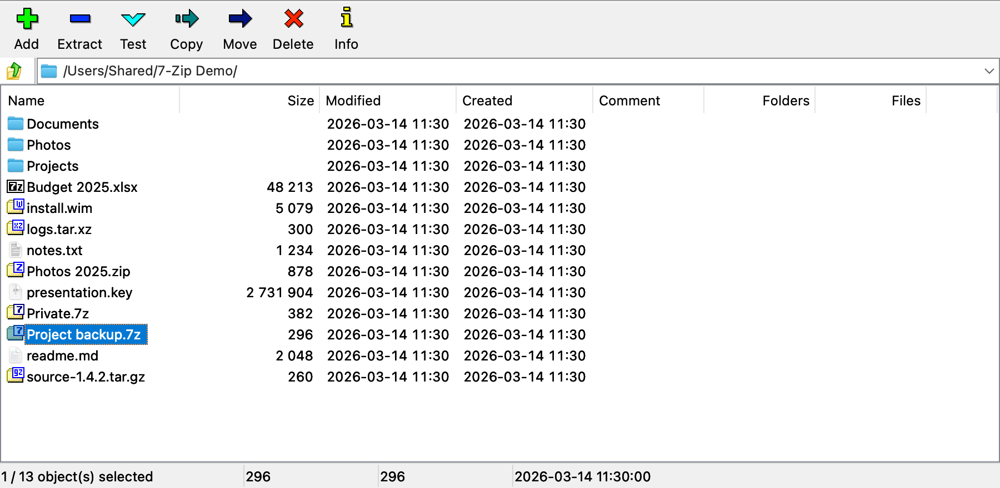
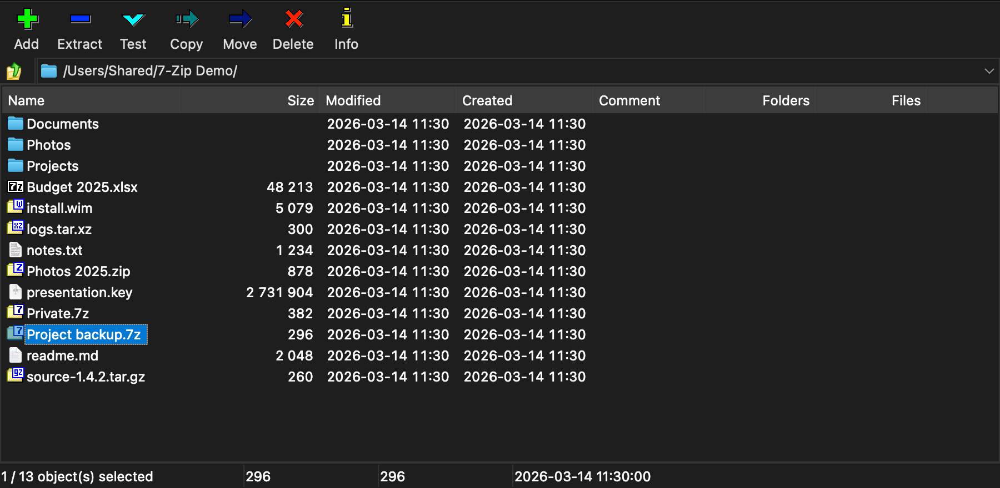
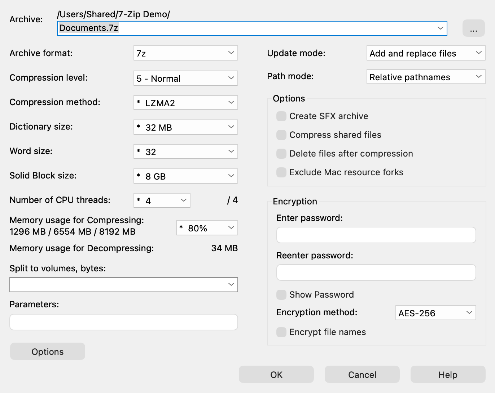
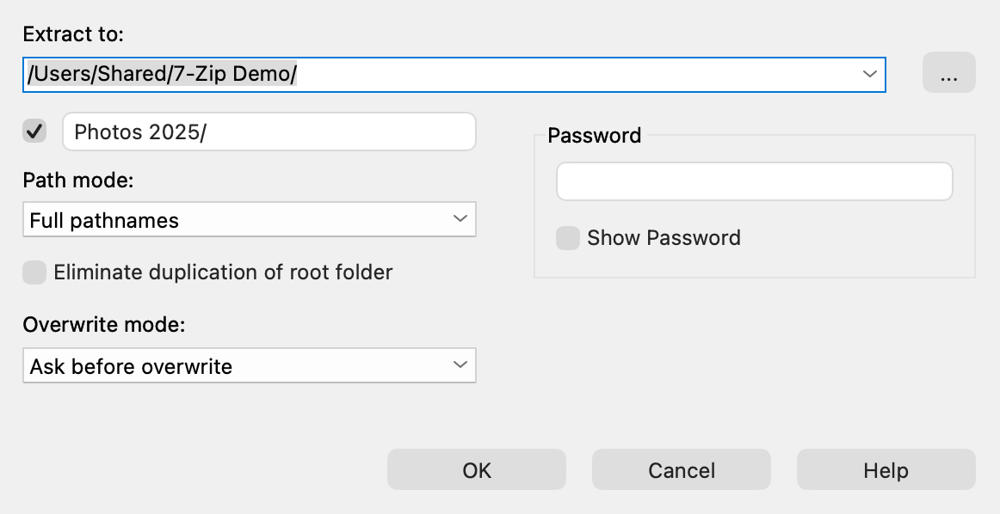
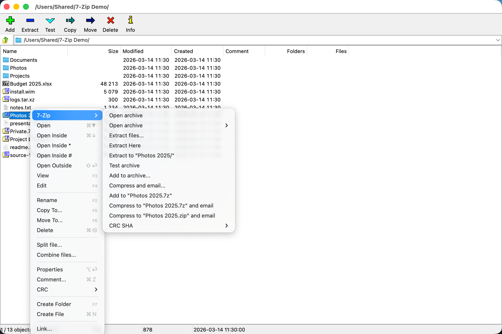
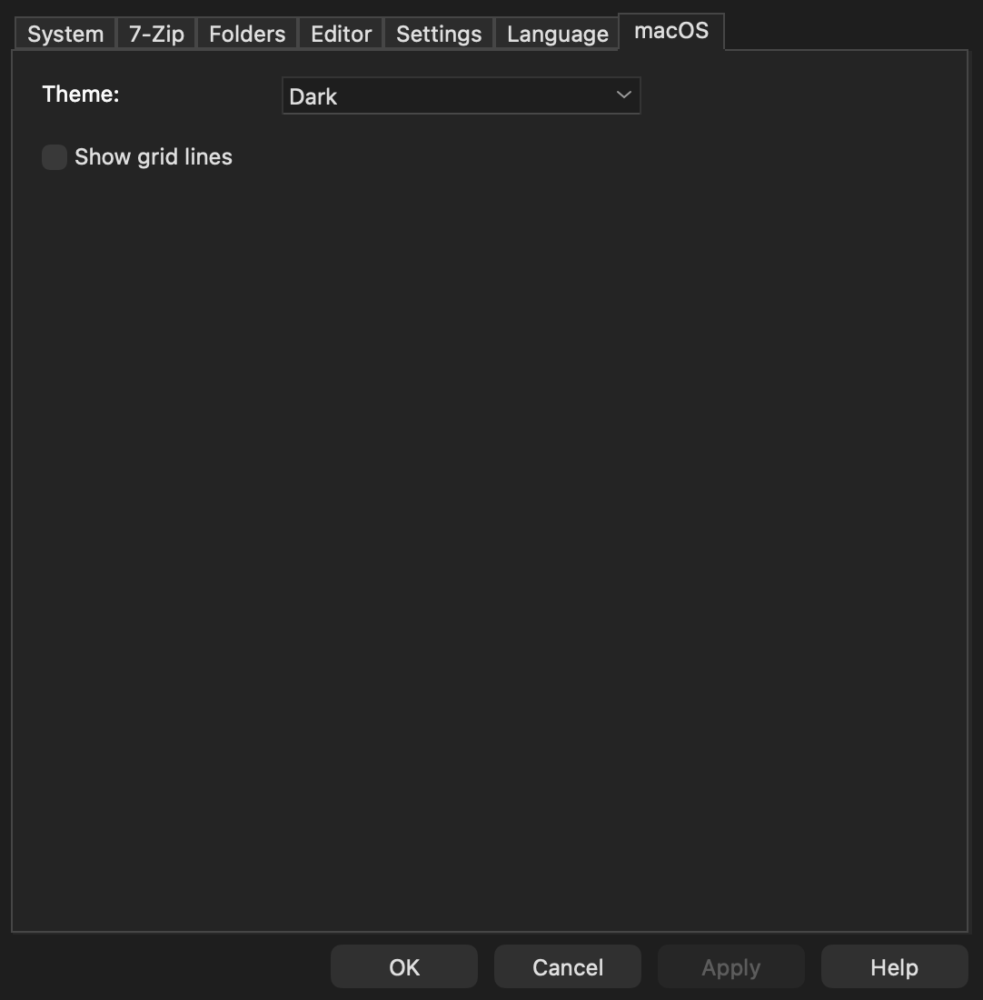

# 7-Zip for macOS (unofficial port)

A native macOS version of the **7-Zip File Manager**: the real 7-Zip 26.04 engine with a new
AppKit interface that follows the Windows app item for item — the same two panels, menus, dialogs,
keyboard map, settings and 93 languages — plus Finder integration.

> **Unofficial.** This project is not affiliated with or endorsed by Igor Pavlov or the 7-Zip
> project. 7-Zip is Igor Pavlov's work ([7-zip.org](https://www.7-zip.org)); this repository is a
> fork of [ip7z/7zip](https://github.com/ip7z/7zip) that adds a macOS app. Please report problems
> with the Mac app here, not to 7-Zip.

Current version: **7-Zip 26.04 for macOS 1.1.0**.





## Features

- **Browse and edit archives like folders** — 7z, ZIP, RAR, TAR, GZip, BZip2, XZ, Zstandard, CAB,
  ISO, DMG, WIM, MSI, RPM, DEB, APFS, VHD and the rest of 7-Zip's formats, including archives
  inside archives.
- **Two panels**, four view modes, sortable columns, flat view, folder history, favorites and
  7-Zip's keyboard map.
- **Extract** with every path and overwrite mode; **Add to archive** with the full set of
  compression options, AES-256 encryption (including file names), multi-volume and
  self-extracting archives.
- **Test**, **checksums** (CRC32, CRC64, SHA-1, SHA-256, SHA-512, BLAKE2sp, XXH64 and more),
  **Benchmark**, **Split**, **Combine**, **Link**, Properties and comments.
- **Finder integration** — a 7-Zip submenu on Finder's right-click menu, Quick Actions, Services,
  and document icons for 40 archive types.
- **93 languages** — the official 7-Zip translations, switchable while the app runs.
- **Light and Dark** themes that follow the system or are set in Options ▸ macOS.
- **Native**: Swift and AppKit on top of the unchanged C/C++ engine. No emulation, no
  third-party code, no network access except the optional update check.

| Add to archive | Extract |
|---|---|
|  |  |

| Context menu with the 7-Zip verbs | Options ▸ macOS |
|---|---|
|  |  |

## Install

Requires **macOS 14 (Sonoma) or newer**, on Apple Silicon or Intel (the release is a universal app).

### Disk image

Download `7-Zip-26.04-macOS-1.1.0.dmg` (the version in the name changes with each release) from
[Releases](https://github.com/yrambler2001/7zip-macos/releases), open it and drag **7-Zip** onto
**Applications**. The app is universal: one download for Apple Silicon and Intel Macs.

### Homebrew

```sh
brew install --cask yrambler2001/tap/7zip-macos
brew trust yrambler2001/tap          # once, so that a plain `brew upgrade` includes the cask (Homebrew 7)
```

Update with `brew upgrade --cask 7zip-macos`. The tap is a personal one
([yrambler2001/homebrew-tap](https://github.com/yrambler2001/homebrew-tap)), updated automatically
with each release. Homebrew keeps macOS's quarantine on the download, so, as with the DMG, the
*Open Anyway* step below is needed after **every** install and every update until the app is
notarized; the cask does not remove the quarantine for you.

### From source

See [docs/building.md](docs/building.md). In short, with Xcode 26 and `brew install xcodegen`:

```sh
Mac/scripts/build.sh --release      # or Mac/scripts/run.sh to build and launch a Debug build
```

## First launch: Gatekeeper

The app is **ad-hoc signed, not notarized** — there is no paid Apple Developer ID behind this
project. A downloaded copy is therefore blocked the first time ("Apple could not verify "7-Zip"
is free of malware"). To allow it:

1. Open 7-Zip once and dismiss the warning.
2. Open **System Settings ▸ Privacy & Security**, scroll to **Security**, and click
   **Open Anyway** next to the message about 7-Zip.
3. Confirm with Touch ID or your password. Later launches open normally.

On macOS 15 and later the old right-click ▸ Open shortcut no longer bypasses this; use the steps
above. If you prefer the terminal, removing the quarantine attribute does the same:

```sh
xattr -dr com.apple.quarantine /Applications/7-Zip.app
```

Builds you make yourself are not quarantined and open directly.

## Finder integration

macOS does not switch extensions on by itself. After the first launch, either tick
**Options ▸ 7-Zip ▸ Integrate 7-Zip to shell context menu** and press OK, or open
**System Settings ▸ General ▸ Login Items & Extensions** and:

- under **File Providers** (Finder Sync), switch on **7-Zip** — the 7-Zip submenu on Finder's
  right-click menu and a toolbar button;
- under **Finder**, switch on **Extract with 7-Zip** and **Compress with 7-Zip** — the Quick
  Actions.

The five **7-Zip: …** Services need nothing; they are in every app's Services menu. Options ▸ 7-Zip
chooses which of the eleven menu entries Finder shows, as on Windows. If the menu never appears,
`pluginkit -m -p com.apple.FinderSync -v` shows whether the extension is enabled (`+`) and which
copy of 7-Zip it belongs to.

The app itself is not sandboxed (it is a file manager), so macOS asks once for access to Desktop,
Documents, Downloads, removable and network volumes as you open them. The Finder extensions are
sandboxed and only see the files you selected.

## Updates

When the File Manager starts, at most once a day, the app asks GitHub whether a newer release
exists; **Help ▸ Check for Updates…** asks at any time. If there is one, a message box shows the
new version and the first lines of its release notes, with **Download** (opens the release page in
your browser), **Later** and **Skip This Version**. Nothing is downloaded or installed by the app.
Homebrew users can also `brew upgrade --cask 7zip-macos`.

**Privacy:** the app contacts `api.github.com` once a day at startup
(`GET /repos/yrambler2001/7zip-macos/releases/latest`, with nothing but the standard `Accept` and
`User-Agent` headers) and makes no other network request. Turn it off in **Options ▸ macOS ▸
Check for updates at startup**; Finder commands (7-Zip's right-click menu) never check.

## Differences from 7-Zip on Windows

The Mac app aims at parity with the Windows File Manager; the differences — Finder instead of
Explorer, the Trash, Command shortcuts, the quarantine attribute instead of Zone.Identifier, the
macOS additions — are summarised in [docs/parity.md](docs/parity.md). Known limitations:
right-to-left languages are not mirrored, and about a quarter of the upstream translations are
incomplete.

## Contributing

Bug reports and pull requests are welcome — see [CONTRIBUTING.md](CONTRIBUTING.md), and
[SECURITY.md](SECURITY.md) for vulnerabilities. Developer documentation:

- [docs/building.md](docs/building.md) — requirements, scripts, signing
- [docs/architecture.md](docs/architecture.md) — engine, bridge, app, extensions
- [docs/testing.md](docs/testing.md) — unit, app-hosted and UI tests
- [docs/upstream.md](docs/upstream.md) — following upstream 7-Zip and the patches to it
- [docs/releasing.md](docs/releasing.md) — CI, cutting a release, the Homebrew tap, signing secrets

Problems in the archive engine itself (a format, compression, the command-line `7zz`) belong
upstream at [7-zip.org](https://www.7-zip.org).

## How this was built

Most of the port was written by AI agents (Claude Code) directed by the maintainer, one scoped
agent per feature, each checked against the Windows app. The plans, specifications and per-feature
reports are kept in [`ai/`](ai/README.md); commits written by an agent carry `Co-Authored-By` and
`Claude-Session` trailers.

## License

7-Zip is Copyright (C) 1999-2026 Igor Pavlov; the macOS port is Copyright (C) 2026 Yurii Synyshyn (yrambler2001).
Both are under the **GNU LGPL 2.1 or later**, with parts under the BSD 3-clause and 2-clause
licences and the RAR code under the unRAR license restriction — see [LICENSE](LICENSE),
[DOC/License.txt](DOC/License.txt) and [NOTICE](NOTICE) (bundled assets, trademarks, upstream
patches). Upstream's own readme is [DOC/readme.txt](DOC/readme.txt).
